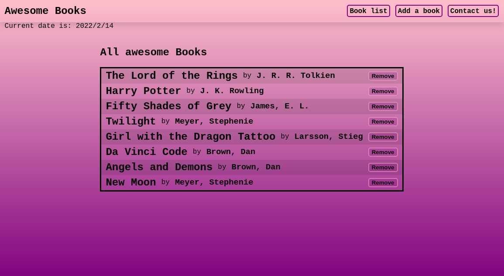

# Awesome Books

> This is my personal portfolio



In this webpage, I have gathered all the projects I've done so far.

## Built With

- HTML
- CSS

## Live Page

[Page Link](https://helio3197.github.io/portfolio)


## Getting Started

To get a local copy up and running follow these simple steps.

### Prerequisites

- Have git correctly installed.

### Setup

- Open a terminal window where you want to have installed a copy of the repository.

### Install

- Use this command to get a copy:
```
git clone git@github.com:helio3197/portfolio.git
```
### Usage

- Edit the content as you like.


## Authors

👤 **Kenny Salazar**

- GitHub: [@helio3197](https://github.com/helio3197)
- Twitter: [@kennysalazar31](https://twitter.com/kennysalazar31)
- LinkedIn: [LinkedIn](https://linkedin.com/in/kenny-salazar-1a1687110)

👤 **Joaquin Garrido**

- GitHub: [@ferminmu26](https://github.com/ferminmu26)
- Twitter: [@ferminmu26](https://twitter.com/ferminmu26)
- LinkedIn: [LinkedIn](https://linkedin.com/in/mejfa)


## 🤝 Contributing

Contributions, issues, and feature requests are welcome!

Feel free to check the [issues page](../../issues/).

## Show your support

Give a ⭐️ if you like this project!

## Acknowledgments

- Thanks to Microverse for the guidelines.
- Thanks to Miguel Fermín for collaborating on the project.


## 📝 License

This project is [MIT](./MIT.md) licensed.
